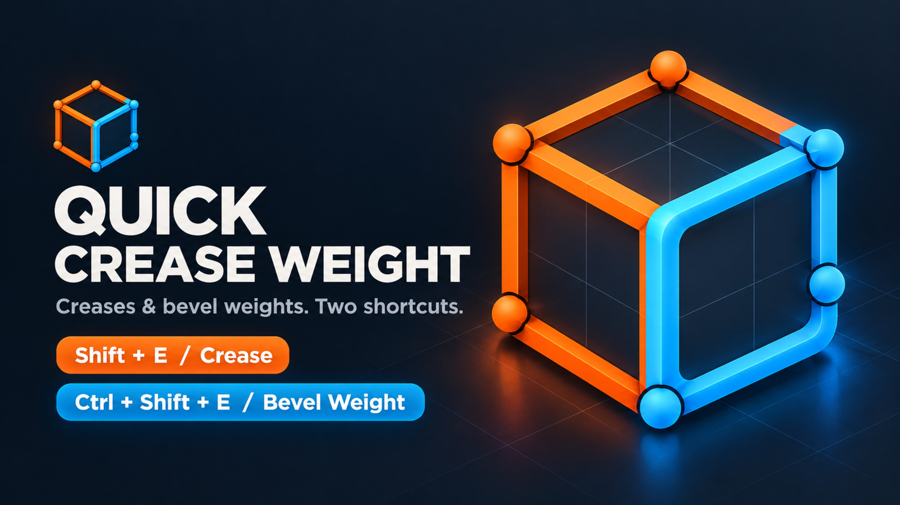
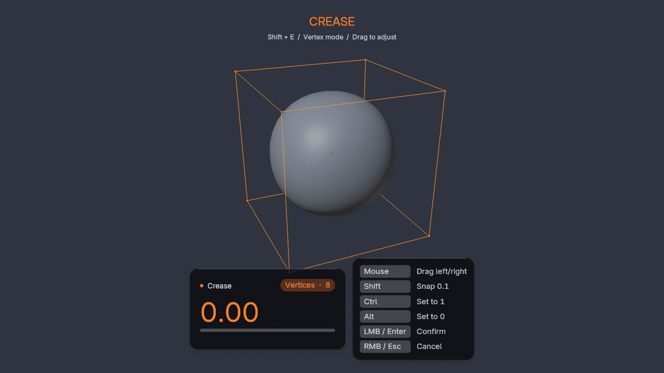

<div align="center">


# Quick Crease Weight

**Two shortcuts for creases and bevel weights in Blender.**

Automatically target vertices or edges in Mesh Edit Mode, then drag to adjust.

[](#compatibility)
[](CHANGELOG.md)
[](LICENSE)

**[Download the add-on ZIP](https://github.com/xz-blender/quick_crease_weight/raw/refs/heads/main/downloads/quick_crease_weight-1.2.2.zip)** · [Quick start](#quick-start) · [Customization](#customization) · [简体中文](README.zh-CN.md)



<sub>Orange creases. Blue bevel weights. Built for Mesh Edit Mode.</sub>

</div>

## Features

- **Selection-aware:** vertex mode targets vertex attributes; edge and face modes target edges.
- **Two tools:** Shift + E for creases, Ctrl + Shift + E for bevel weights.
- **Distinct themes:** orange for creases, blue for bevel weights, with separate color settings.
- **Live HUD:** a rounded value card with a selection badge and pill-shaped progress bar; a separate floating shortcut list stays visible on its right throughout adjustment.
- **Customizable:** native Blender shortcut editing, mouse sensitivity, and HUD styling.
- **Reversible:** cancel restores individual values; confirmed operations support Blender undo.
- **Multi-object editing:** shared mesh data is processed once.
- **Efficient updates:** cached HUD geometry and layout, plus mesh writes only when the applied value changes.
- **English and Simplified Chinese:** automatically follows Blender's interface language, including the live HUD and status bar.
- **Standalone:** no third-party Python packages required.

## See it in action



Recorded in **Blender 4.5.4** with the actual add-on. Subdivision Surface and Bevel modifiers visualize the weights. Both README translations use the English demo and interface screenshots by default; the add-on still follows Blender's language settings. [Watch or download the MP4](docs/media/demo.mp4).

## Quick start

1. Download the **add-on ZIP** linked above.
2. In **Edit → Preferences → Add-ons**, choose **Install from Disk** from the menu, select the ZIP, and enable **Quick Crease Weight**.
3. Enter Mesh Edit Mode and select vertices or edges. Invoke a tool, move the mouse horizontally, and left-click to confirm.

> [!TIP]
> Use the validated add-on ZIP, which excludes documentation images and tests. **Code → Download ZIP** downloads the development source tree.

| Input | Action |
| --- | --- |
| <kbd>Shift</kbd> + <kbd>E</kbd> | Adjust crease |
| <kbd>Ctrl</kbd> + <kbd>Shift</kbd> + <kbd>E</kbd> | Adjust bevel weight |
| Move mouse horizontally | Adjust within **0–1** |
| Hold <kbd>Shift</kbd> | Snap in **0.1** increments |
| Press <kbd>Ctrl</kbd> / <kbd>Alt</kbd> | Set to **1** / **0** |
| Left-click / <kbd>Enter</kbd> | Confirm |
| Right-click / <kbd>Esc</kbd> | Cancel and restore |
| Middle mouse / scroll wheel | Orbit / zoom |

Release invocation modifiers before pressing them again to use adjustment controls. The initial value is the selection average. Once adjusted, all selected elements receive the same value. Invoking and confirming without adjustment preserves original values.

**Shortcut overlap:** the default **Shift + E** binding takes precedence over Blender's built-in crease shortcut in Mesh Edit Mode. Change or disable the add-on binding in its preferences if you prefer the built-in operation. Disabling this add-on removes its keymap entries.

**Interface language:** the HUD, tool labels, preferences, status bar, and warnings follow Blender's language in **Preferences → Interface → Translation**. English and Simplified Chinese are supported, including Blender's **Automatic** system-language setting. Changes apply without re-enabling the add-on. Interface, tooltip, and report translations respect Blender's separate switches; untranslated text falls back to English. The add-on works offline, collects no telemetry, and requires no accounts, other add-ons, or third-party packages.

## Customization

Open **Preferences → Add-ons → Quick Crease Weight**.

| Setting | Options |
| --- | --- |
| Shortcuts | Key, modifiers, enabled state |
| Interaction | Mouse sensitivity |
| HUD layout | Bottom, top, or cursor; horizontal and vertical offsets |
| HUD appearance | Font size, text color, separate crease/bevel theme colors, background opacity, corner radius, card shadow, text shadow |
| Visibility | HUD, right-hand shortcut list, progress bar |

Mouse and keyboard hints live entirely in the right-hand list. Both panels share the selected styling and move together; the layout scales down to fit narrow viewports. Disable **Show Right-hand Shortcut List** in preferences to hide the list.


<details>
<summary><strong>View the preferences interface</strong></summary>


Actual preferences layout in an isolated test window. The crease shortcut has been changed to **Shift + Q** to demonstrate customization; the default remains **Shift + E**.

</details>

Settings persist with Blender preferences. Save manually if Auto-Save Preferences is disabled.

## Behavior and troubleshooting

| Selection mode | Crease attribute | Bevel-weight attribute |
| --- | --- | --- |
| Vertex | `crease_vert` | `bevel_weight_vert` |
| Edge / Face | `crease_edge` | `bevel_weight_edge` |

Vertex mode takes priority in mixed selection modes. Only visible, selected elements are affected. Cancel also removes attribute layers created by the current operation.

- **No visible bevel?** Add a Bevel modifier, choose the Weight limit method, and select the appropriate vertex/edge affect mode. Creases are typically viewed with a Subdivision Surface modifier.
- **Mixed starting values?** Cancel restores each element's original value, including across multiple meshes.

## Performance

Local Blender 4.5.4 comparison against v1.1.2, using the same benchmark:

| Scenario | Before | v1.2.0 |
| --- | ---: | ---: |
| HUD idle / cursor movement, median CPU submission | ~1.29 ms | ~0.09 ms |
| HUD changing values, median CPU submission | 1.29 ms | 0.20 ms |
| Update 200,344 selected edges, median per changed value | 8.18–8.36 ms | 3.82–3.83 ms |
| Mesh updates for 20 repeated identical values | 20 | 0 |

These timings measure add-on work, not total viewport frame time. The first write builds the element cache; later writes reuse it. See [methodology and full results](docs/PERFORMANCE.md).

## Compatibility

Declared minimum: **Blender 4.2**. Local verification results:

| Version | Integration tests | Window interaction checks |
| --- | --- | --- |
| 4.3.2 | 14 passed | 12 translation scenarios passed, including live switching and narrow HUD layout |
| 4.5.4 LTS | 14 passed | 12 translation scenarios passed; shortcuts, remapping, cancel, undo, HUD and preferences passed |
| 5.2.0 LTS Beta, local build | 14 passed | 12 translation scenarios passed, including live switching and narrow HUD layout |
| 5.3.0 Alpha, local build | 13 passed before the translation update | — |
| 4.2.0 | 14 passed | Not locally tested |

These results do not imply testing on every operating system or Blender build.

<details>
<summary><strong>Development and packaging</strong></summary>

Run from the project directory in PowerShell:

```powershell
$blender = 'C:\path\to\blender.exe'
& $blender --background --factory-startup --python-exit-code 1 --python tests/blender_integration.py
& $blender --factory-startup --command extension validate
New-Item -ItemType Directory -Path dist -Force | Out-Null
& $blender --factory-startup --command extension build --output-dir dist
& $blender --factory-startup --command extension validate dist/quick_crease_weight-1.2.2.zip
```

For real window checks:

```powershell
& $blender --factory-startup --enable-event-simulate --python tests/blender_ui_smoke.py
& $blender --factory-startup --enable-event-simulate -p 60 60 900 900 --python tests/blender_translation.py
```

The UI scripts use factory-startup test windows, do not save user preferences, and close the windows when finished. Results are written to `tests/artifacts/`. The translation checks cover live language changes, independent translation switches, localized errors, registration cycles, and measured HUD bounds.

</details>

## Credits and license

Icons, cover art, and the recorded demo are available in the [media kit](docs/media/README.md), including English demonstration exports for the Blender Extensions listing.

**Author:** WXZ.

Licensed under **GPL-3.0-or-later**: GNU GPL version 3 or, at your option, any later version. The version 3 text is included in [LICENSE](LICENSE).
