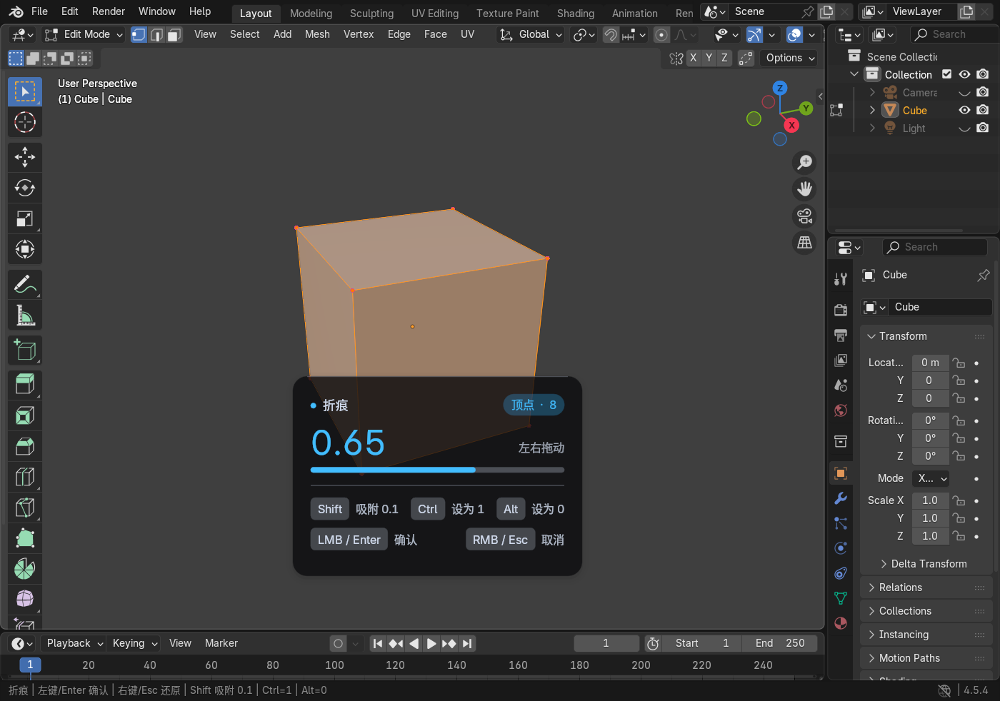
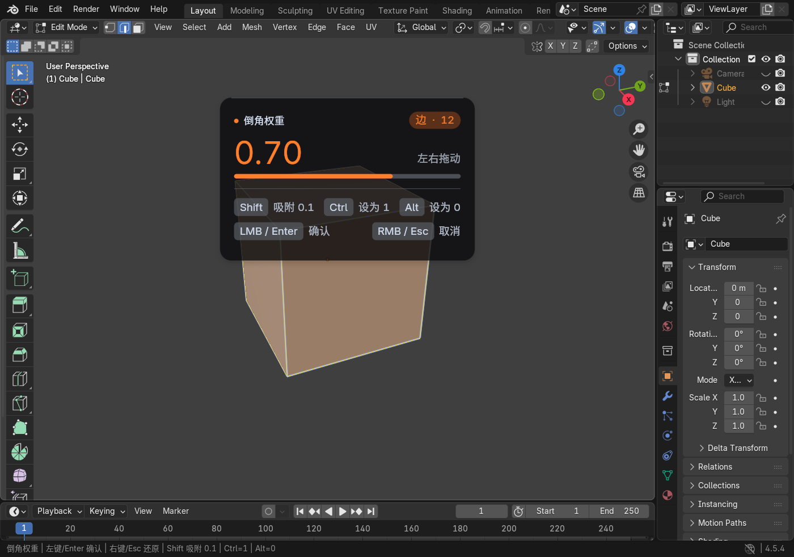
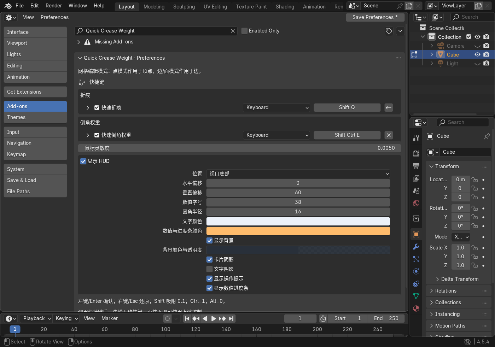

<div align="center">

# Quick Crease Weight

**两组快捷键，让折痕与倒角权重跟上建模节奏。**

在 Blender 网格编辑模式中，根据点 / 边选择模式自动选择属性，拖动鼠标即可调整。

[](#兼容性)
[](CHANGELOG.md)
[](LICENSE)
[](#功能一览)

**[下载插件 ZIP](https://github.com/xz-blender/quick_crease_weight/raw/refs/heads/main/downloads/quick_crease_weight-1.1.0.zip)** · [快速开始](#快速开始) · [自定义设置](#自定义设置) · [English](README.md)



<sub>实际 Blender 4.5.4 视口截图：顶点折痕、实时数值和操作提示。</sub>

</div>

## 功能一览

| 功能 | 使用体验 |
| --- | --- |
| **自动识别点 / 边** | 点模式调整顶点属性，边和面模式调整边属性，无需切换工具。 |
| **折痕 + 倒角权重** | 默认 <kbd>Shift</kbd> + <kbd>E</kbd> 和 <kbd>Ctrl</kbd> + <kbd>Shift</kbd> + <kbd>E</kbd>。 |
| **实时 HUD** | 圆角卡片、醒目数值、选择标签、胶囊进度条和分组按键提示。 |
| **快捷键与外观可定制** | 原生键位编辑器，配合位置、字号、颜色和背景透明度设置。 |
| **可取消、可撤销** | 取消恢复每个元素的原值；确认后使用 Blender 撤销。 |
| **多物体编辑** | 同时调整多个编辑中的网格，共享网格只处理一次。 |
| **独立运行** | 无第三方 Python 依赖，安装后即可使用。 |

## 快速开始

1. **安装插件**：下载上方 ZIP，在 Blender 的 **编辑 → 偏好设置 → 插件** 菜单中选择 **从磁盘安装 / Install from Disk**，选择 ZIP 并启用 **Quick Crease Weight**。
2. **选择元素**：进入网格编辑模式，切换到点或边选择，选中要调整的元素。
3. **调用并调整**：按 <kbd>Shift</kbd> + <kbd>E</kbd> 设置折痕，或 <kbd>Ctrl</kbd> + <kbd>Shift</kbd> + <kbd>E</kbd> 设置倒角权重；左右移动鼠标，左键确认。

> [!TIP]
> 请使用上方的**插件 ZIP**。它已经过 Blender 扩展校验，并排除了文档配图和测试文件；GitHub 的 **Code → Download ZIP** 是开发源码包。

### 操作速查

| 输入 | 操作 |
| --- | --- |
| <kbd>Shift</kbd> + <kbd>E</kbd> | 开始调整折痕 |
| <kbd>Ctrl</kbd> + <kbd>Shift</kbd> + <kbd>E</kbd> | 开始调整倒角权重 |
| 鼠标左右移动 | 在 **0–1** 范围内连续调整 |
| 按住 <kbd>Shift</kbd> | 按 **0.1** 吸附 |
| 按下 <kbd>Ctrl</kbd> / <kbd>Alt</kbd> | 设置为 **1** / **0** |
| 左键 / <kbd>Enter</kbd> | 确认 |
| 右键 / <kbd>Esc</kbd> | 取消并恢复原值 |
| 中键 / 滚轮 | 旋转 / 缩放视图 |

调用后先松开快捷键中的修饰键，再重新按下以使用上述控制，避免启动倒角权重工具时意外将数值设为 1。

初始显示值是所选元素的**平均值**；开始拖动后，所选元素会被设置为同一个值。仅调用后直接确认不会改写原值。

## 自定义设置

打开 **偏好设置 → 插件 → Quick Crease Weight**。

| 设置 | 可调整内容 |
| --- | --- |
| 快捷键 | 两个工具的按键、修饰键及启用状态 |
| 操作手感 | 鼠标灵敏度 |
| HUD 布局 | 底部居中、顶部居中、跟随鼠标，水平 / 垂直偏移 |
| HUD 外观 | 字号、文字颜色、数值颜色、背景颜色与透明度、圆角半径、卡片阴影、文字阴影 |
| 信息显示 | HUD 总开关、操作提示、数值进度条 |

<p align="center">
  
  <br><sub>自定义示例：顶部定位、更大的字号与橙色数值。</sub>
</p>

<details>
<summary><strong>查看偏好设置界面</strong></summary>



截图来自独立测试窗口中的实际偏好设置布局；折痕快捷键已演示性地改为 **Shift + Q**，安装后的默认值仍为 **Shift + E**。

</details>

设置随 Blender 偏好设置保存。未开启自动保存时，请点击 **保存偏好设置**。

## 选择模式与属性

| 选择模式 | 折痕属性 | 倒角权重属性 |
| --- | --- | --- |
| 点 | `crease_vert` | `bevel_weight_vert` |
| 边 / 面 | `crease_edge` | `bevel_weight_edge` |

混合选择模式中，**点模式优先**。工具只处理可见且选中的元素，取消时还会移除本次新建的属性层。

## 常见问题

<details>
<summary><strong>已写入倒角权重，为什么没有看到倒角效果？</strong></summary>

本插件负责写入权重。需要添加倒角修改器，将限制方式设为 **权重 / Weight**，并选择与顶点或边属性对应的影响模式。折痕效果则通常配合细分曲面修改器查看。

</details>

<details>
<summary><strong>所选元素原来有不同数值，取消能完整恢复吗？</strong></summary>

可以。工具保存每个选中元素的原值；右键或 Esc 会分别恢复它们，包括多物体编辑中的各个网格。

</details>

## 兼容性

最低声明版本：**Blender 4.2**。以下是本机实际验证记录，不代表所有系统和版本组合都已测试。

| 版本 | 集成检查 | 窗口交互检查 |
| --- | --- | --- |
| 4.3.2 | 10 项通过 | 窄视口、圆角 HUD、快捷键、取消与撤销通过 |
| 4.5.4 LTS | 10 项通过 | 快捷键、改键、取消、撤销、圆角 HUD、偏好设置通过 |
| 5.3.0 Alpha 本机构建 | 10 项通过 | — |
| 4.2 | 尚未实测 | 尚未实测 |

<details>
<summary><strong>开发、验证与打包</strong></summary>

在项目目录运行以下 PowerShell 命令，并将 `$blender` 改为本机 Blender 路径：

```powershell
$blender = 'C:\path\to\blender.exe'

# 使用真实 Blender 数据检查属性写入、还原、多物体编辑与注册。
& $blender --background --factory-startup --python-exit-code 1 --python tests/blender_integration.py

# 校验并构建安装包。
& $blender --factory-startup --command extension validate
New-Item -ItemType Directory -Path dist -Force | Out-Null
& $blender --factory-startup --command extension build --output-dir dist
& $blender --factory-startup --command extension validate dist/quick_crease_weight-1.1.0.zip
```

界面测试：

```powershell
& $blender --factory-startup --enable-event-simulate --python tests/blender_ui_smoke.py
```

界面测试在工厂设置窗口中运行，不保存用户偏好设置，结束后自动关闭。结果位于 `tests/artifacts/`。

| 文件 | 职责 |
| --- | --- |
| `mesh_data.py` | 选择快照、属性写入与取消还原 |
| `operators.py` | 交互操作、确认与清理 |
| `hud.py` | 视口绘制 |
| `preferences.py` / `keymaps.py` | 偏好设置与键位注册 |

</details>

## 作者与许可

作者：**WXZ**。

采用 **GPL-2.0-or-later**：可按 GNU GPL 第 2 版或任何后续版本使用、修改和分发。完整第 2 版文本见 [LICENSE](LICENSE)。
